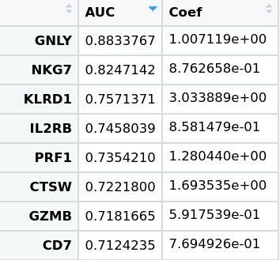
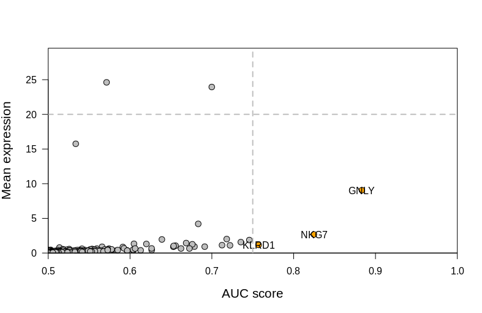
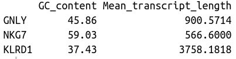

Gene selection for smFISH and seqFISH
===================================

Single-cell RNAseq experiment provide a comprehensive description of cell transcriptome at the single level but lack critical spatial information while single molecular (sm) and sequential (seq) FISH reveals critical spatial information but can only measure a reduced number of genes (4/5 genes for smFISH, 20 to 100 for seqFISH). A judicious choice of the measured genes is therefore mandatory  before performing any sm/seqFISH experiment. In the following manual we will see how to choose the best genes using the results of a reference scRNA-seq dataset analysis.

List of the constraints
-----------------------------------------------

Lets say we want to construct a gene panel for a set of cell types, for instance cancer immune infiltrating cells. For each cell type of interest, the selected genes must fulfill the following criteria :

1. It must be a **good classifier**, i.e knowing the expression level of this gene allows to predict if the a cell is a cell of interest. 
2. It has to be a **positive marker** : a cell type can not be described as non-expressing a gene... 
3. It must be expressed by the cells of interest in a **given expression range**.
4. The coding sequence of the gene must be **long enough** and not with a **unbalanced GC content**.

We will consider that 2 marker genes per cell population/cluster is enough for a FISH experiment.


Walktrougth
----------------------------------

The first step is to  annotate a reference scRNA-seq dataset. I would recommend to look at the [Gene Expression Omnibus (GEO)] (https://www.ncbi.nlm.nih.gov/gds) repository platform if you do not have a suited reference dataset. The data can then be analyzed using any scRNA-seq analysis pipeline of your choice like [Seurat] (https://www.ncbi.nlm.nih.gov/gds) or [Pagoda2] (https://github.com/hms-dbmi/pagoda2). 

In this example we will use a recently published dataset by [Li et al.] (https://www.ncbi.nlm.nih.gov/pubmed/30595452) where immune cells from human melanoma were sequenced using the [MARS-seq 2.0 technology] (https://www.nature.com/articles/s41596-019-0164-4).

A quick analysis using Pagoda2 reveals that immune infiltrate mostly consists of lymphocytes, including Natural Killer (NK) cells, powerful cytotoxic cells that can eliminate tumor cells. It might be therefore interesting to study them using spatial transcriptomic. In our analysis those cells correspond to cluster 11.

First load all the required functions and packages using the following command :

```r
source("path/to/Gene_selection_script.R")
```
You can then look for the genes that can discriminate between cells from cluster 11 and other ones. To do so simply type :

```r
AUC_table_NK = Compute_AUC_marker(Expression_table,Clustering==11)
```
where the **Expression_table** objects corresponds to a normalized expression matrix (in a cell x gene format) and **Clustering**  a vector containing the cluster assigned to each cell. To increase computational speed we recommend to perform the analysis only on the most variable genes as the non variable genes are not likely to be expressed in a cell type specific manner.

The obtained table contains two columns :

1. 	One with the Area Under the Curve (AUC) score computed for each gene. This score ranges from 0.5 (no better than a random classification) to 1 (perfect classifier).
2. 	One with the coefficient used in the associated logistic regression. A positive value means that the gene is over-expressed in the cell type of interest compared to other cells, while a negative value indicates an under-expression.


A quick overview of the table suggests that several good candidates have been identified such as **GNLY**, **NKG7** and **KLRD1**.



We now need to check that those genes are not too higly expressed by NK cells, indeed if a gene is too higly expressed the probes' Point Spread Functions will overlap, making the quantification impossible. The corresponding expression level can be estimated using the **raw** expression data, i.e the UMI count table.

We can therefore compute the mean expression of the count table : 

```r
Mean_raw_expression = rowMeans(UMI_table[,Clustering==11])
```
We can then finish by creating a diagnostic plot that summarize our analysis :

```r
Diagnostic_plot (AUC_table_NK[1,],Mean_raw_expression)
```

This will produce this plot :



Here only three genes have an AUC which is high enough (AUC > 0.75) and an expression level that is not too high (less than 20 UMIs expressed per cell). Indeed, as mRNA capture rate is 5 to 10 times more efficient using smFISH compared to 3' based scRNA-seq techniques, a theshold of 20 UMIs will result to a hundred of mRNA molecules observed per cell, an acceptable threshold.

Lastly we need to check that the targeted genes do not have too short transcripts : to check this we provide txt files containing the mean transcript length of each gene for both mouse and human. Moreover GC content is also provided :

```r
Human_gene_data = read.delim('/path/to/Gene_annotation_human.txt',row.names=1)
print(Human_gene_data[c("GNLY","NKG7","KLRD1"),])
```




Using this table, we observed that while **KLRD1** has long transcripts, **NKG7** and to a stronger extent **GNLY** have short transcripts. Therefore the two genes to target would be **KLRD1** and **GNLY**.


